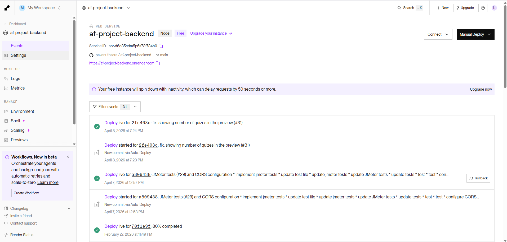
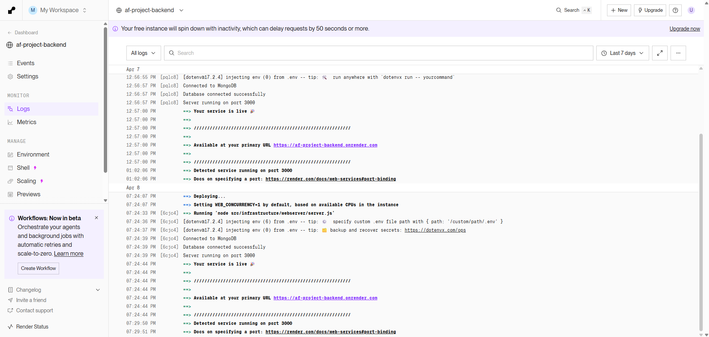

# Deployment Report

> **AF Project Backend** — Deployed on [Render](https://render.com)
>
> **Live URL:** [https://af-project-backend.onrender.com](https://af-project-backend.onrender.com)

## Deployment Screenshots




---

## Environment Variables

The following environment variables must be configured in the **Render Dashboard** under **Environment → Environment Variables**:

| Variable            | Description                                       | Required |
| ------------------- | ------------------------------------------------- | -------- |
| `MONGO_URI`         | MongoDB Atlas connection string                   | ✅       |
| `PORT`              | Server port (Render provides this automatically)  | ❌       |
| `NODE_ENV`          | Set to `production` on Render                     | ✅       |
| `JWT_SECRET`        | Secret key for signing JWT tokens                 | ✅       |
| `GROK_API_KEY`      | Groq API key for translation & explanation services | ✅     |
| `GEMINI_API_KEY`    | Google Generative AI key for AI identification    | ✅       |
| `CLIMATIQ_API_KEY`  | Climatiq API key for carbon footprint data        | ✅       |

> **⚠️ Important:** The `.env` file is listed in `.gitignore` and is **never** committed to the repository. All secrets must be set directly in the Render Dashboard.

### Setting Environment Variables on Render

1. Go to the [Render Dashboard](https://dashboard.render.com).
2. Select the **af-project-backend** service.
3. Navigate to **Environment** in the left sidebar.
4. Click **Add Environment Variable** for each variable listed above.
5. Click **Save Changes** — the service will redeploy automatically.

---

## Deployment Overview

| Property           | Value                                              |
| ------------------ | -------------------------------------------------- |
| **Platform**       | Render (Web Service)                               |
| **Live URL**       | https://af-project-backend.onrender.com            |
| **Runtime**        | Node.js                                            |
| **Entry Point**    | `src/infrastructure/webserver/server.js`            |
| **Package Manager**| pnpm                                               |
| **Branch**         | `main`                                             |
| **Region**         | Auto (Render default)                              |
| **Plan**           | Free / Starter                                     |

The application is deployed as a **Web Service** on Render with automatic deploys triggered on every push to the `main` branch.

---

## Technology Stack

| Component             | Technology           | Version  |
| --------------------- | -------------------- | -------- |
| **Runtime**           | Node.js              | 18.x / 20.x |
| **Framework**         | Express              | 5.2.1    |
| **Database**          | MongoDB Atlas        | Cloud    |
| **ODM**               | Mongoose             | 9.2.0    |
| **Authentication**    | JSON Web Tokens      | 9.0.3    |
| **Password Hashing**  | bcryptjs             | 3.0.3    |
| **AI / Translation**  | Groq SDK             | 0.37.0   |
| **AI / Identification** | Google Generative AI | 0.24.1 |
| **HTTP Client**       | Axios                | 1.13.5   |
| **File Uploads**      | Multer               | 2.0.2    |
| **Env Management**    | dotenv               | 17.2.4   |

---

## Render Service Configuration

The service was configured via the **Render Dashboard** (no `render.yaml` or `Dockerfile` is used).

### Build & Start Settings

| Setting            | Value                                        |
| ------------------ | -------------------------------------------- |
| **Build Command**  | `pnpm install`                               |
| **Start Command**  | `node src/infrastructure/webserver/server.js` |
| **Auto-Deploy**    | Yes (on push to `main`)                      |

### How to Deploy

1. **Push to `main`** — Render automatically detects the push via the connected GitHub repository and triggers a new deployment.
2. **Manual Deploy** — From the Render Dashboard, navigate to the service and click **"Manual Deploy" → "Deploy latest commit"**.

### Render Deployment Flow

```
Push to main branch
       │
       ▼
Render detects change
       │
       ▼
Build Phase
  ├─ pnpm install (installs production + dev dependencies)
  └─ Build completes
       │
       ▼
Start Phase
  ├─ node src/infrastructure/webserver/server.js
  ├─ dotenv loads environment variables
  ├─ Mongoose connects to MongoDB Atlas
  └─ Express server listens on PORT (provided by Render)
       │
       ▼
Service is LIVE at https://af-project-backend.onrender.com
```

> **Note:** On the Render Free plan, the service **spins down after 15 minutes of inactivity** and takes ~30–50 seconds to cold-start on the next request.

---

## CI/CD Pipeline

### GitHub Actions Workflow

The project includes a CI pipeline defined in `.github/workflows/build.yml` that runs on every push and pull request to the `main` branch:

```
Push / PR to main
       │
       ▼
GitHub Actions: CI Build Check
  ├─ Checkout repository
  ├─ Install pnpm (v10)
  ├─ Setup Node.js (18.x, 20.x matrix)
  ├─ pnpm install --frozen-lockfile
  ├─ Syntax check: node --check src/infrastructure/webserver/server.js
  └─ Run tests: pnpm run test
       │
       ▼
✅ All checks pass → Merge allowed
       │
       ▼
Render auto-deploys from main
```

## API Endpoints Available in Production

### Public Endpoints

| Method | Endpoint                          | Description                |
| ------ | --------------------------------- | -------------------------- |
| POST   | `/signup`                         | User registration          |
| POST   | `/login`                          | User login                 |
| POST   | `/admin/login`                    | Admin login                |
| POST   | `/logout`                         | Logout (client-side token clear) |

### Protected User Endpoints

| Method | Endpoint                                 | Description                          |
| ------ | ---------------------------------------- | ------------------------------------ |
| GET    | `/profile`                               | View authenticated user profile      |
| GET    | `/recycling-centers`                     | List recycling centers               |
| GET    | `/recycling-centers/:id`                 | Get recycling center by ID           |
| GET    | `/recycling-centers/by-waste/:wasteType` | Filter centers by waste type         |
| POST   | `/recycling-centers/search`              | Search recycling centers             |
| POST   | `/disposal`                              | Log a waste disposal                 |
| GET    | `/disposal/history`                      | View disposal history                |
| GET    | `/disposal/stats`                        | View personal waste stats            |
| PUT    | `/disposal/:id`                          | Update a disposal log                |
| DELETE | `/disposal/:id`                          | Delete a disposal log                |

### Quiz Module Endpoints

| Method | Endpoint                             | Description                    |
| ------ | ------------------------------------ | ------------------------------ |
| GET    | `/api/quizzes`                       | List all quizzes               |
| GET    | `/api/quizzes/:quizId/play`          | Get quiz for play              |
| POST   | `/api/quizzes/:quizId/submit`        | Submit quiz answers            |
| GET    | `/api/quizzes/certificates`          | View earned certificates       |
| POST   | `/api/quizzes`                       | Create quiz (Admin)            |
| POST   | `/api/quizzes/:quizId/questions`     | Add question (Admin)           |
| PUT    | `/api/quizzes/questions/:questionId` | Update question (Admin)        |
| DELETE | `/api/quizzes/questions/:questionId` | Delete question (Admin)        |

### Waste Management Endpoints

| Method | Endpoint              | Description              |
| ------ | --------------------- | ------------------------ |
| GET    | `/api/categories`     | List waste categories    |
| POST   | `/api/categories`     | Create category          |
| GET    | `/api/categories/:id` | Get category by ID       |
| PUT    | `/api/categories/:id` | Update category          |
| DELETE | `/api/categories/:id` | Delete category          |
| GET    | `/api/items`          | List waste items         |
| POST   | `/api/items`          | Create waste item        |
| GET    | `/api/items/:id`      | Get item by ID           |
| PUT    | `/api/items/:id`      | Update waste item        |
| DELETE | `/api/items/:id`      | Delete waste item        |

### AI Module Endpoints

| Method | Endpoint    | Description              |
| ------ | ----------- | ------------------------ |
| *      | `/api/ai/*` | AI identification routes |

### Admin / Manager Endpoints

| Method | Endpoint                          | Description                       |
| ------ | --------------------------------- | --------------------------------- |
| POST   | `/admin/register`                 | Register new admin (Admin only)   |
| POST   | `/admin/recycling-centers`        | Register recycling center (Admin) |
| DELETE | `/admin/recycling-centers/:id`    | Delete recycling center (Admin)   |
| PUT    | `/manager/recycling-centers/:id`  | Update recycling center (Manager) |
| GET    | `/admin/disposal/stats`           | View disposal stats (Admin)       |

---

## Post-Deployment Verification

After every deployment, verify the service is running correctly:

### Quick Health Check

```bash
# Check if the server is responding
curl https://af-project-backend.onrender.com/profile
# Expected: 401 Unauthorized (no token) — confirms server is alive

# Test public endpoint
curl https://af-project-backend.onrender.com/api/categories
```

### Viewing Logs on Render

1. Go to the [Render Dashboard](https://dashboard.render.com).
2. Select the **af-project-backend** service.
3. Click **Logs** in the left sidebar.
4. Expected startup logs:
   ```
   Connected to MongoDB
   Server running on port <PORT>
   ```

---

## Troubleshooting

### Common Issues

| Issue                                | Cause                                         | Solution                                            |
| ------------------------------------ | --------------------------------------------- | --------------------------------------------------- |
| `MONGO_URI is not defined`           | Missing environment variable on Render        | Add `MONGO_URI` in Render Dashboard → Environment   |
| Service crashes on startup           | Invalid MongoDB connection string or DB is down | Check `MONGO_URI` value; verify Atlas cluster status |
| 502 Bad Gateway                      | Server hasn't started yet (cold start)        | Wait 30–50 seconds; retry the request               |
| Requests timeout                     | Free-tier spin-down                           | First request wakes the service; subsequent requests are fast |
| `JsonWebTokenError`                  | `JWT_SECRET` mismatch between environments    | Ensure the same `JWT_SECRET` is set on Render       |
| Translation / AI features not working | `GROK_API_KEY` or `GEMINI_API_KEY` not set    | Add API keys in Render Dashboard → Environment      |
| MongoDB network error                | Atlas IP whitelist doesn't include Render IPs | Add `0.0.0.0/0` to Atlas Network Access             |

---

> **Last Updated:** April 2026
